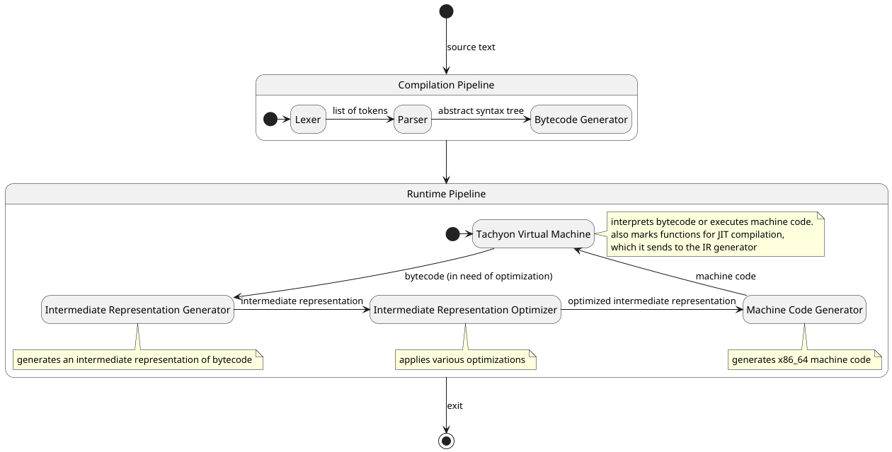

# Pipeline

## Description

This document describes the overall architecture of the Tachyon programming language and
just-in-time compiler.

## Definitions

<!-- definitions are sorted in alphabetical order -->

### <type of> Pipeline

A <type of> Pipeline is a sequence of steps that results in the manipulation of data.

These definitions are intended for the purposes of this document only.

### Bytecode

### Compile-time

Compile-time is any period in time during which the Tachyon program is attempting to translate a
given piece of source text to bytecode. This primarily includes the lexing, parsing, and bytecode
generation steps.

### Just-In-Time (JIT) Compilation

Just-In-Time compilation is the concept of compiling a specific set of instructions into machine
code just before running it. The specific instructions to compile are identified by the virtual
machine.

### Memoization

[Memoization](https://en.wikipedia.org/wiki/Memoization) is the concept of storing the results
of previously called functions in memory, such that calling the same function with the same
arguments can just refer to the cached value, instead of executing the function again. Function
memoization only works on pure functions, so side effects are not "skipped" when the value is
retrieved from cache.

### Pure Function

A pure function is any function that always returns the same value given the same arguments, and
has no side effects (such as writing to files, printing to a console, etc.). If a function is
pure, it can be memoized, which involves its return value being cached and read in future calls
with the same arguments. An impure function cannot be cached this way because it will "skip"
these side effect operations (such as writing the output of a function to a file) during cache hits.

### Runtime

Runtime is any period in time during which the Tachyon program is attempting to execute bytecode
or its machine code counterpart. This primarily includes the virtual machine execution,
intermediate representation generation, and intermediate representation optimization steps.

### User

The user is anyone that is writing and expects to execute Tachyon code.

## Architecture

The overall architecture of Tachyon is split into two key pipelines:

### Compile-time Pipeline

The compile-time pipeline consists of:

* Lexer (done): turns the source text into a list of tokens
* Parser (done): turns the list of tokens into an abstract syntax tree
* Bytecode Generator (done): turns the abstract syntax tree into a list of bytecode instructions

By the end of this pipeline, Tachyon has a list of bytecode instructions that represent the code
written by the user

### Runtime Pipeline

The runtime pipeline consists of:

* Tachyon Virtual Machine (incomplete): interprets the bytecode (done), executes machine code
  (incomplete), tracks/marks instructions for optimization (incomplete)
* Intermediate Representation Generator (incomplete): generates intermediate representation from
  bytecode

### Intermediate Representation

Why take the step of generating intermediate representation, when one could directly attempt to
optimize the bytecode (or ast)? The reason is that optimizing these structures is extremely
difficult and, even if implemented correctly, compute-intensive. It is easier to generate a
representation of the intent of the code (i.e. abstract individual instructions into an
intermediate representation) than to optimize the instructions directly.

### Marking Functions for Memoization

During bytecode generation, the kinds of instructions are recorded. If all instructions are pure,
the function overall is marked as pure, and the virtual machine is able to cache its input and
return values during runtime. Function impurities propagates to parents. If function a calls
function b that is impure, a is implicitly impure.

### Marking Instructions for Optimization (TODO)